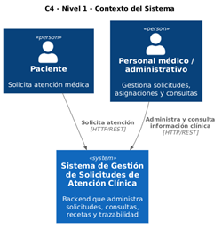
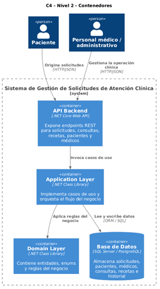
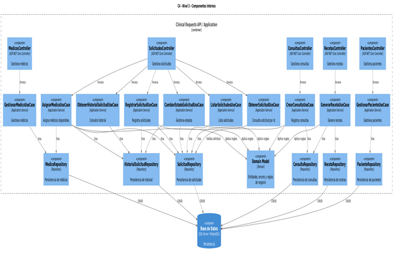
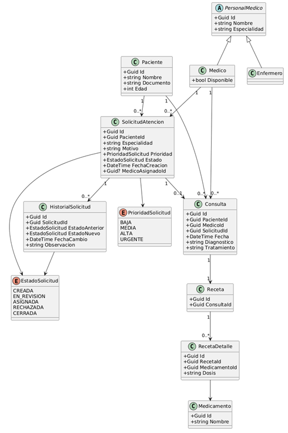

# Sistema de Gestión de Solicitudes de Atención Clínica

## 1. Introducción

El presente documento describe la arquitectura del sistema **Sistema de Gestión de Solicitudes de Atención Clínica**, el cual tiene como objetivo digitalizar y optimizar el proceso de atención médica en una clínica ambulatoria.  
Actualmente, el proceso se realiza de forma manual, generando errores en la asignación de citas, falta de trazabilidad y poca visibilidad del estado de las solicitudes.  
El sistema propuesto permitirá gestionar el ciclo de vida completo de una solicitud clínica, desde su creación hasta su resolución, incorporando reglas de negocio, asignación de médicos y registro de historial.

## 2. Objetivo del sistema

Diseñar e implementar un backend basado en .NET Core y arquitectura hexagonal, que permita:

- Registrar solicitudes de atención
- Validar reglas de negocio
- Asignar médicos según disponibilidad
- Gestionar estados del proceso
- Registrar consultas médicas
- Generar recetas
- Mantener trazabilidad completa

## 3. Alcance funcional

**Incluye:**
- Gestión de solicitudes
- Gestión de pacientes
- Gestión de personal médico
- Gestión de consultas médicas
- Gestión de recetas
- Historial de eventos

**No incluye (por ahora):**
- UI / frontend
- Integración con sistemas externos
- Agenda de citas
- Notificaciones (email/SMS)

## 4. Arquitectura del sistema

### Contexto


### Contenedores


### Componentes


### Diagrama de clases



### 4.1 Estilo arquitectónico

Se adopta **Arquitectura Hexagonal** (Ports & Adapters):

- **Domain**
- **Entidades**
- **Reglas de negocio**
- **Application**
- **Casos de uso**
- **Orquestación**
- **Infrastructure**
- **Persistencia**
- **Repositorios**
- **API**
- **Controladores REST**

### 4.2 Principios aplicados

- Separación de responsabilidades
- Inversión de dependencias
- Bajo acoplamiento
- Alta cohesión
- Testabilidad
- Extensibilidad

## 5. Modelo de dominio

**Entidades principales**

- **Paciente**
    - Id
    - Nombre
    - Documento
    - Edad

- **Personal Médico**
    - Médico
    - Enfermero

- **SolicitudAtencion**
    - Id
    - PacienteId
    - Especialidad
    - Motivo
    - Prioridad
    - Estado
    - FechaCreacion
    - MedicoAsignadoId

- **Consulta**
    - Diagnóstico
    - Tratamiento
    - Fecha
    - Relación con solicitud

- **Receta**
    - Lista de medicamentos
    - Dosis

- **HistorialSolicitud**
    - EstadoAnterior
    - EstadoNuevo
    - Fecha
    - Observación

## 6. Reglas de negocio

- No se puede crear una solicitud sin paciente.
- No se puede crear sin especialidad.
- No se puede asignar una solicitud rechazada o cerrada.
- No se puede cerrar sin asignación.
- Debe existir médico disponible.
- Toda transición genera historial.

## 7. Arquitectura Hexagonal (Puertos)

### Puertos de entrada

- RegistrarSolicitud
- AsignarMedico
- CambiarEstado
- CrearConsulta
- GenerarReceta

### Puertos de salida

- Repositorios
- Base de datos
- Servicios externos (futuro)

## 8. Modelo de datos

**Tablas principales**
- Solicitudes
- Pacientes
- Medicos
- Consultas
- Recetas
- Medicamentos
- HistorialSolicitudes

## 9. Endpoints del sistema

### Solicitudes

- **POST** /api/solicitudes  
- **GET** /api/solicitudes  
- **GET** /api/solicitudes/{id}  
- **POST** /api/solicitudes/{id}/asignar  
- **PATCH** /api/solicitudes/{id}/estado  
- **GET** /api/solicitudes/{id}/historial  

### Consultas

- **POST** /api/consultas  
- **GET** /api/consultas  
- **GET** /api/consultas/{id}  

### Recetas

- **POST** /api/recetas  
- **GET** /api/recetas/{id}  

### Pacientes

- **POST** /api/pacientes  
- **GET** /api/pacientes  
- **GET** /api/pacientes/{id}  
- **PUT** /api/pacientes/{id}  

### Médicos

- **POST** /api/medicos  
- **GET** /api/medicos  
- **GET** /api/medicos/{id}  
- **PUT** /api/medicos/{id}  
- **GET** /api/medicos/disponibles  

## 10. Descripción detallada de los endpoints

### Nombre: /api/solicitudes  
- **HTTP METHOD**: POST  
- **Utilidad**: Registrar una nueva solicitud de atención clínica.  
- **Header**:  
    - Accept: application/json  
    - Content-Type: application/json  
    - Authorization: Bearer {token}  
    - X-Correlation-ID: {uuid}

```json
{
  "nombrePaciente": "Juan Pérez",
  "documentoPaciente": "123456",
  "especialidad": "CARDIOLOGIA",
  "motivo": "Dolor en el pecho",
  "prioridad": "ALTA"
}